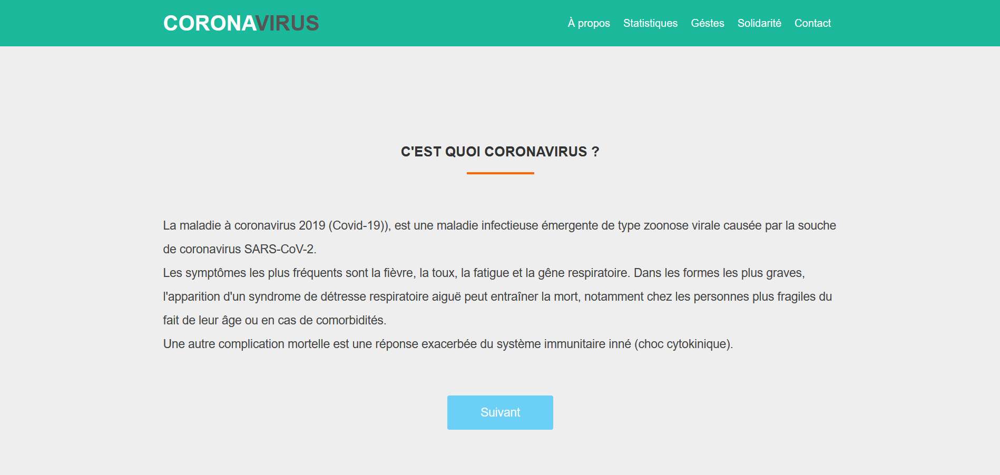
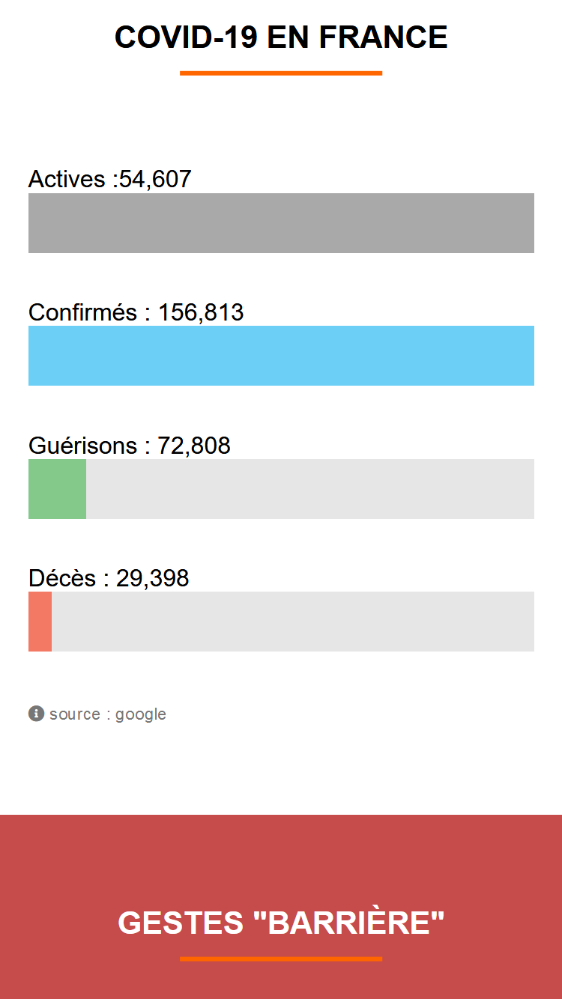

# Covid-19
Le projet "Covid-19" a vu le jour pendant le premier confinement avec pour objectif de mettre en place les compétences apprisent en autodidacte durant cette période, l'objectif était de créer one page avec plusieurs sections.

HTML5, CSS3, Javascript, Git, GitHub, Flex 

### Voir la démo => [[Click Here]](https://hassanelgallouchi.github.io/covid19/)

### Accueil Desktop

### Accueil Mobile

